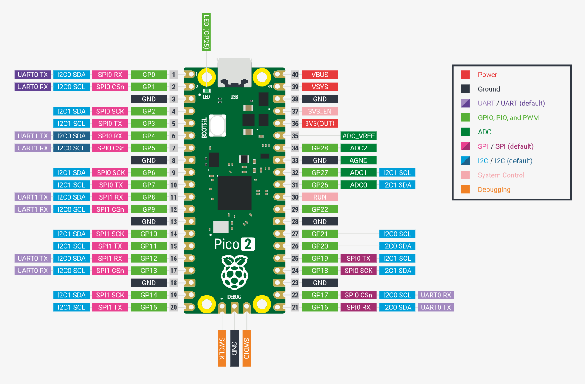

# 🧠 Raspberry Pi Pico 2 Projects Repository

Welcome to the **Raspberry Pi Pico 2 Projects Repository**!  
This repository showcases firmware experiments and embedded hardware projects built using the **Raspberry Pi Pico 2**, the second-generation RP2040-based microcontroller board from Raspberry Pi.

---

## 🔍 What is the Raspberry Pi Pico 2?

The **Raspberry Pi Pico 2** is a low-cost, high-performance microcontroller development board based on the **RP2040** chip. It is a refined successor to the original Pico, featuring improved silicon, slight hardware upgrades, and maintaining a strong focus on versatility and GPIO access.

🛑 **Note:** This version is **not wireless** — it does **not include Wi-Fi or Bluetooth**. If you're looking for wireless capability, check out the **Pico W 2** instead.

---

## ⚙️ Key Specifications

| Feature                    | Description                                                 |
|---------------------------|-------------------------------------------------------------|
| **Microcontroller**       | RP2040 (Dual-core ARM Cortex-M0+ @ 133 MHz)                 |
| **Flash Storage**         | 2 MB QSPI Flash                                             |
| **RAM**                   | 264 KB SRAM                                                 |
| **GPIO Pins**             | 26 multifunction GPIOs (3.3V logic)                         |
| **Analog Inputs**         | 3 × 12-bit ADC channels                                     |
| **Communication**         | I2C, SPI, UART, PWM, USB                                    |
| **Power Input**           | USB-C (5V) or VSYS (1.8V to 5.5V)                           |
| **USB Support**           | USB 1.1 device & host support                               |
| **Operating Voltage**     | 3.3V I/O                                                    |
| **Onboard LED**           | GPIO25                                                      |

---

## 🧠 How It Works

The Pico 2 is powered by the **RP2350A0A2** microcontroller, a dual-core ARM Cortex-M0+ processor designed by Raspberry Pi. You flash your code to the board over USB using a drag-and-drop `.uf2` file or via a debugger if using C/C++. The **BOOTSEL** button puts the board into USB bootloader mode for easy programming.

It supports both **bare-metal development** and **high-level scripting**, making it ideal for beginner and advanced users alike.

---

## 🧰 Programming Options

- **MicroPython** – Easy scripting and fast prototyping.
- **CircuitPython** – Adafruit’s flavor with additional support libraries.
- **C/C++ SDK** – Official low-level support for performance applications.
- **Arduino IDE** – Beginner-friendly with many libraries (via board manager).

---

## 🧪 Example Use Cases

- GPIO logic and control  
- Sensor interfacing (I2C, SPI, UART)  
- Real-time data acquisition  
- ADC-based voltage monitoring  
- PWM motor or LED control  
- Logic analyzers or timing tools  

---

## 📦 Getting Started

1. **Download MicroPython or CircuitPython firmware**  
   https://www.raspberrypi.com/documentation/microcontrollers/pico.html

2. **Flash the board**  
   - Hold down **BOOTSEL** button
   - Plug in USB-C to your PC
   - Drop the `.uf2` file onto the new USB drive named `RPI-RP2`

3. **Start coding**
   - Use Thonny IDE (for MicroPython)
   - Use Arduino IDE with RP2040 board support
   - Use VSCode with the Pico C SDK for full C/C++ development

---

## 🔌 GPIO & Peripherals

| Peripheral | Pin Example        |
|------------|--------------------|
| Onboard LED | GPIO25             |
| UART       | GPIO0 (TX), GPIO1 (RX) |
| I2C        | GPIO4 (SDA), GPIO5 (SCL) |
| SPI        | GPIO10 (MOSI), GPIO11 (MISO), GPIO12 (SCK) |
| ADC        | GPIO26–28 (12-bit resolution) |

📝 All GPIOs are 3.3V logic. Do not exceed 3.3V input on any pin.

---

## 📸 Pinout Diagram

---

## 📚 Resources

- [RP2040 Datasheet](https://datasheets.raspberrypi.com/rp2040/rp2040-datasheet.pdf)
- [Getting Started with MicroPython](https://www.raspberrypi.com/documentation/microcontrollers/micropython.html)
- [C/C++ SDK Docs](https://www.raspberrypi.com/documentation/microcontrollers/c_sdk.html)
- [CircuitPython RP2040 Guide](https://learn.adafruit.com/getting-started-with-raspberry-pi-pico-circuitpython)

---

## 📁 Repository Structure

